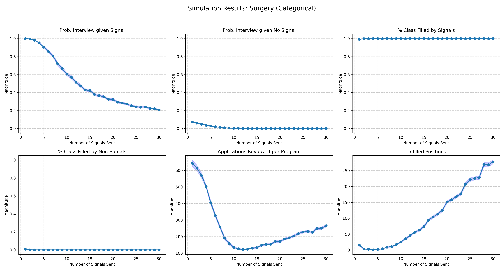
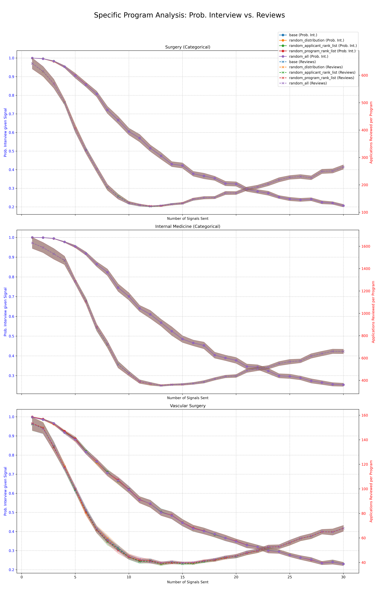
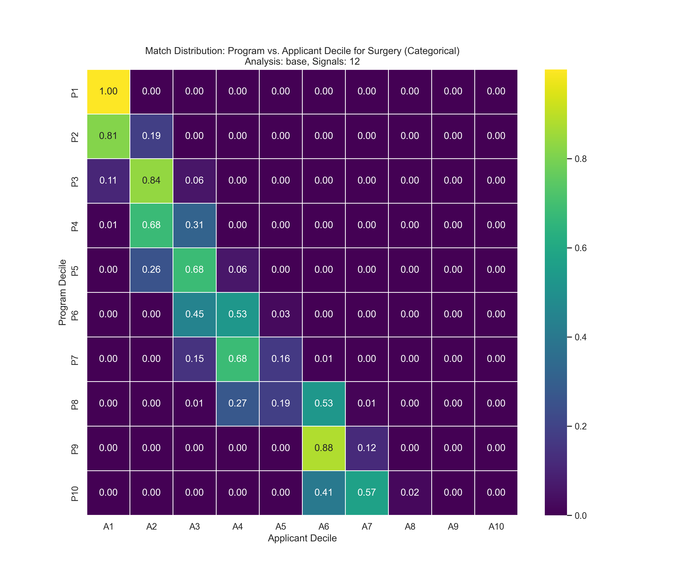
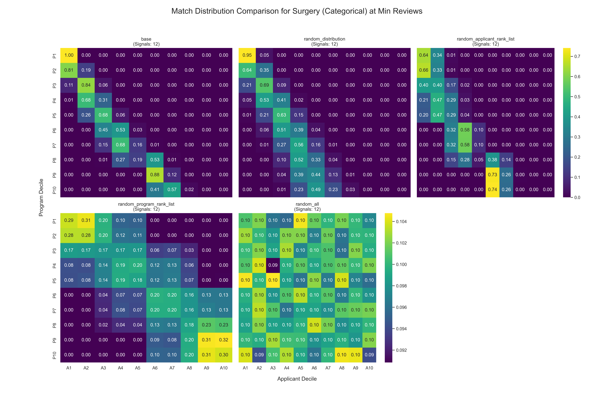

# Medical Residency Match Simulation

This project is a Python-based simulation designed to analyze the medical residency matching process, with a specific focus on the impact of "signals" on match outcomes. It uses data from the National Resident Matching Program (NRMP) to model the behavior of applicants and programs. The simulation explores various scenarios and parameters to understand their effects on key metrics like the number of applications, match rates, and unfilled positions.

# Getting Started

## 1. Installation

Install the required Python packages using pip:

```bash
pip install -r requirements.txt
```

## 2. Generating Constants

The simulation's parameters are stored in a Parquet file located at `constants/constants.parquet`. This file is generated by the `create_constants.py` script. Before running the main simulation, you may need to generate or update this file.

To generate the constants, run the following command:

```bash
python constants/create_constants.py
```

This will create the `constants.parquet` file, which contains a variety of scenarios for the simulation. The script uses base data from `constants/nrmp_base_data.csv` and generates a range of simulation parameters using statistical distributions.

# Running the Simulation

## 1. Configure Analysis Variations

The simulations to be run are configured in the `analysis_variations.csv` file. Each row in this file defines an analysis scenario with different randomization settings.

The columns in `analysis_variations.csv` are:
- `analysis_name`: A unique name for the analysis scenario. This name is used in the output file paths.
- `run_bool`: A boolean (True/False) that determines whether to run this analysis scenario.
- `random_application_distribution`: If True, applicants apply to programs randomly, ignoring quartiles.
- `random_applicant_rank_list`: If True, applicants' rank lists are randomized.
- `random_program_rank_list`: If True, programs' rank lists are randomized.

## 2. Execute the Simulation

The main simulation script is `probabilistic_simulation.py`. To run the enabled simulations, execute the script from the root directory of the project:

```bash
python probabilistic_simulation.py
```

The script will read the `analysis_variations.csv` file, run the enabled simulations in parallel, and save the results to the `results/` directory. Each analysis will have its own output file named `results_{analysis_name}.csv`.

# Generating Figures

The `create_figures.py` script is used to generate visualizations from the simulation results. You can control which types of figures are generated by setting the boolean flags at the top of the script:

- `GRAPH_INDIVIDUAL_ANALYSES`: Generates a 2x3 panel of plots for each program specialty for each analysis type. Output is saved in `figures/{analysis_name}/`.
- `GRAPH_COMBINED_SCENARIOS`: Generates a 2x3 panel of plots for each program, comparing all 5 analysis scenarios on each plot. Output is saved in `figures/joint/combined/`.
- `GRAPH_DUAL_AXIS_PROGRAMS`: Generates a dual-axis plot for a specific set of programs, comparing interview probability and application reviews. Output is saved in `figures/joint/`.
- `GRAPH_DECILE_PLOTS`: Generates decile heatmap plots. This includes individual heatmaps for each program and analysis, as well as a combined 2x3 heatmap figure for each program comparing the 5 analyses. Outputs are saved in `figures/{analysis_name}/` and `figures/joint/combined/`.

To generate the graphs, run:

```bash
python create_figures.py
```

# Example Figures

Here are some example figures generated for the "Surgery (Categorical)" specialty.

### Individual Metrics Plot

This plot shows key metrics for a single analysis. This example is for the 'base' analysis.



### Dual-Axis Plot

This plot compares the probability of an interview with the number of applications reviewed for a set of specialties.



### Decile Heatmap

This heatmap shows the distribution of matches between program deciles and applicant deciles for a single analysis.



### Combined Decile Heatmap Comparison

This figure compares the decile match distribution across all five analysis scenarios for a single specialty.




# Project Structure

- **`probabilistic_simulation.py`**: The main entry point for running the simulations.
- **`probabilistic_simulation_helpers.py`**: Contains helper functions for the main simulation script.
- **`create_figures.py`**: Main script for generating all figures.
- **`individual_graphs.py`**: Generates plots for individual analysis scenarios.
- **`combined_graphs.py`**: Generates plots comparing different analysis scenarios.
- **`decile_graphs.py`**: Generates decile heatmap plots.
- **`analysis_variations.csv`**: Configuration file for defining analysis scenarios.
- **`constants/`**: Stores the datasets and scripts used in the simulation.
  - **`create_constants.py`**: Script to generate the `constants.parquet` file.
  - **`nrmp_base_data.csv`**: Base data from NRMP used to generate simulation scenarios.
  - **`constants.parquet`**: The file containing all the simulation parameters (generated).
- **`results/`**: The default output directory for simulation results.
- **`figures/`**: The default output directory for generated graphs and plots.
- **`readme_figures/`**: Contains example figures for the README.
- **`requirements.txt`**: Lists the Python dependencies for the project.

# Simulation Mechanics

The simulation operates through the following steps:

1.  **Initialization**: The main script initializes the simulation environment, reading the scenarios from `constants/constants.parquet`.
2.  **Scenario Execution**: For each scenario, the script runs a series of simulations in parallel. Each simulation involves:
    - **Applicant and Program Creation**: Applicants and programs are modeled as objects with specific attributes, including rankings and preferences.
    - **Application Process**: Applicants choose which programs to apply to, considering factors like program quality and signals.
    - **Interview Selection**: Programs review applications and invite a limited number of candidates for interviews, prioritizing signaled applications.
    - **Rank-Order Lists**: Both applicants and programs create rank-order lists based on their preferences.
    - **Matching Algorithm**: The simulation uses a stable matching algorithm, similar to the one used by the NRMP, to match applicants to programs.
3.  **Data Collection**: After each simulation, the script collects data on a wide range of outcomes, including:
    - Match rates for applicants.
    - The number of filled and unfilled positions at programs.
    - The effectiveness of signals in securing interviews and final matches.
    - The total number of applications reviewed by programs.
4.  **Results Storage**: The aggregated results from all simulations are stored in CSV files in the `results/` directory for further analysis.

# Key Assumptions

- The simulation is based on a simplified model of the residency match and does not capture all the complexities of the real-world process.
- Applicant and program preferences are primarily based on rankings, with signals providing an additional layer of preference.
- The number of interviews a program can offer is limited, creating a competitive environment for applicants.
- The simulation assumes that both applicants and programs act rationally to maximize their outcomes based on the available information.
