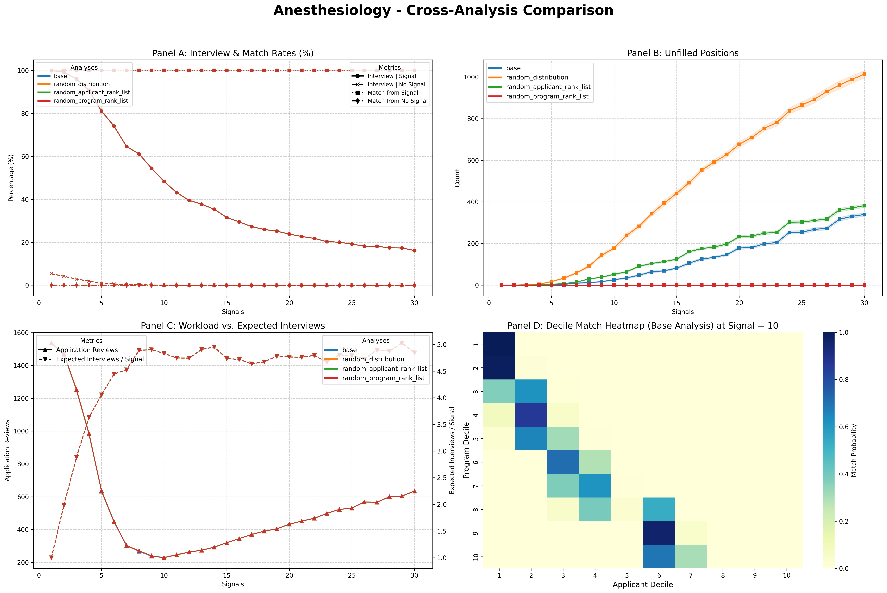
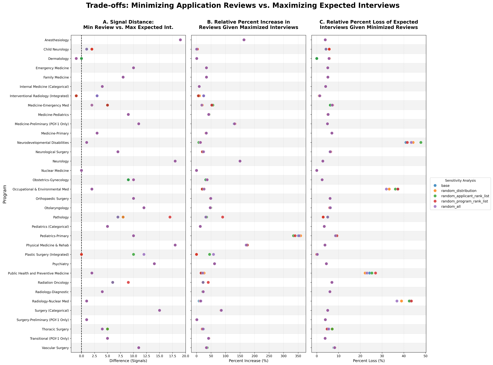

# Medical Residency Match Simulation

This project is a Python-based simulation designed to analyze the medical residency matching process, with a specific focus on the impact of "signals" on match outcomes. It uses data from the National Resident Matching Program (NRMP) to model the behavior of applicants and programs. The simulation explores various scenarios and parameters to understand their effects on key metrics like the number of applications, match rates, and unfilled positions. This study is currently under review.

Title: A Computation Approach to Residency Match Preference Signaling: Balancing Benefit for Programs and Applicants


# Getting Started

## 1. Installation

Install the required Python packages using pip:

```bash
pip install -r requirements.txt
```

## 2. Generating Constants

The simulation's parameters are stored in a Parquet file located at `constants/{gamma_folder}/constants.parquet`. This file is generated by the `constants/create_constants.py` script. 

To generate the constants, run the following command:

```bash
python constants/create_constants.py
```

This will create the `constants.parquet` file, which contains a variety of scenarios for the simulation. The script uses base data from `constants/nrmp_base_data.csv` and generates a range of simulation parameters using statistical distributions (Gamma distribution for applications and interviews per position).

# Running the Simulation

## 1. Configure Analysis Variations

The simulations to be run are configured in the `analysis_variations.csv` file. Each row defines an analysis scenario with different randomization settings.

The columns in `analysis_variations.csv` are:
- `analysis_name`: A unique name for the analysis scenario (e.g., `base`, `random_distribution`).
- `run_bool`: Whether to run this analysis scenario.
- `random_application_distribution`: If True, applicants apply to programs randomly, ignoring quartiles.
- `random_applicant_rank_list`: If True, applicants' rank lists are randomized (within signaled/non-signaled categories).
- `random_program_rank_list`: If True, programs' rank lists are randomized (within signaled/non-signaled categories).

## 2. Execute the Simulation

The main simulation script is `probabilistic_simulation.py`. To run the enabled simulations:

```bash
python probabilistic_simulation.py
```

The script reads the `constants.parquet` file, runs simulations in parallel using `ProcessPoolExecutor`, and saves raw results to `results/model_output/`.

# Data Processing

After running the raw simulation, the results must be processed into summary statistics (means and confidence intervals):

```bash
python transform_model_outputs.py
```

This script reads the raw CSVs from `results/model_output/`, calculates 95% confidence intervals, and derives additional metrics like "Expected Interviews per Signal". The processed data is saved to `results/calculated/`.

# Generating Figures

The project includes two primary scripts for visualizing the results:

1.  **`panel_graphs.py`**: Generates a 4-panel figure for specific programs (e.g., Anesthesiology, General Surgery). These panels compare different analysis scenarios across metrics like interview rates, unfilled positions, and workload. This will also generate 6-panel decile graphs.
2.  **`residual_graphs.py`**: Generates a "residual analysis" plot that looks at the distance between optimal signal values across all specialties.

You may specify within each python file what programs to graph and the input/output directories.

To generate the figures, run:

```bash
python panel_graphs.py
python residual_graphs.py
```

# Example Figures

### 4-Panel Specialty Comparison
This figure shows the impact of signaling on Anesthesiology across four different sensitivity analyses.



### Residual Analysis
This plot evaluates the "trade-off" for programs and applicants: the relative increase in program workload required to maximize the expected interviews per signal for applicants.




# Project Structure

- **`probabilistic_simulation.py`**: The main entry point for running the simulations.
- **`probabilistic_simulation_helpers.py`**: Helper functions for quartiles, deciles, and simulation workers.
- **`transform_model_outputs.py`**: Processes raw simulation results into statistical summaries.
- **`panel_graphs.py`**: Generates detailed 4-panel plots for individual specialties.
- **`residual_graphs.py`**: Generates the cross-specialty residual analysis plot.
- **`analysis_variations.csv`**: Configuration file for defining analysis scenarios.
- **`constants/`**:
  - **`create_constants.py`**: Generates simulation parameters.
  - **`nrmp_base_data.csv`**: Base NRMP data used for initialization.
- **`results/`**:
  - **`model_output/`**: Raw CSV files from the simulation.
  - **`calculated/`**: Processed statistical summaries.
- **`readme_figures/`**: Contains example figures for this README.

# Simulation Mechanics

The simulation operates through the following steps:

1.  **Initialization**: Scenarios are loaded from `constants.parquet`.
2.  **Applicant and Program Creation**: 
    - Applicants are assigned to quartiles/deciles based on "quality".
    - Applicants choose programs based on a 50/25/25 distribution (50% in their quartile, 25% in the one above, 25% below) unless randomized.
3.  **The Signaling/Interview Phase**:
    - Applicants send a fixed number of signals.
    - Programs review applications, prioritizing signaled applications first.
    - Programs offer interviews up to their capacity.
4.  **Matching Algorithm**:
    - The simulation uses an **Applicant-Proposing Deferred Acceptance Algorithm** (stable matching), mirroring the NRMP Match.
    - Both parties create rank-order lists. Signals are prioritized in program rankings.
5.  **Data Collection**: Results are aggregated across hundreds of iterations per signal value to ensure statistical significance.

# Key Assumptions

- Applicants and programs generally prefer higher-ranked counterparts (quartile-based preference).
- Signals act as a "tie-breaker" or priority filter for programs when selecting whom to interview and rank.
- The simulation models the "Match" as a stable marriage problem, which is the mathematical foundation of the real NRMP algorithm.

# Disclaimers

Artificial intelligence was used to assist with graphing functionality and minor code-block completion. No AI-based tools were used for study design nor the implementation of the main probabilistic_simulation.py file. See manuscript for full model details. 
